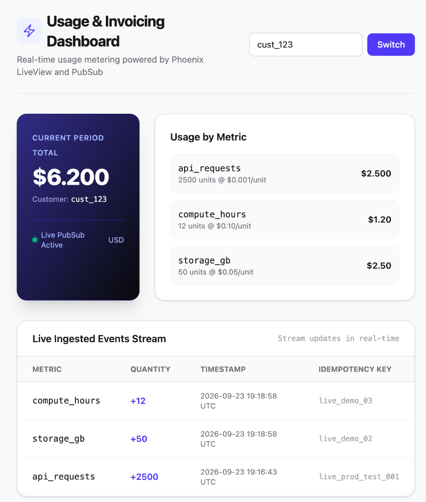

# TallyHo

Usage metering and billing dashboard built with Elixir, Phoenix, and LiveView.



## Prerequisites

- [mise](https://mise.jdx.dev/) (runtime version manager)
- PostgreSQL 17
- macOS (development)

## Setup

### 1. Install Erlang & Elixir

```bash
# mise reads .mise.toml and installs the pinned versions
mise install
```

Verify:

```bash
elixir --version
# Elixir 1.18.5 (compiled with Erlang/OTP 27)
```

### 2. Install PostgreSQL

```bash
brew install postgresql@17
brew services start postgresql@17
```

### 3. Start the app

```bash
mix setup        # install deps, create DB, run migrations
mix phx.server   # start at localhost:4000
```

Visit the dashboard in your browser — it's behind HTTP Basic Auth (dev credentials are `admin` / `admin`, see `config/dev.exs`):
- **Dashboard:** [http://localhost:4000/dashboard/cust_123](http://localhost:4000/dashboard/cust_123)

Or start inside IEx (interactive Elixir REPL + server):

```bash
iex -S mix phx.server
```

## Running Tests

```bash
mix test                       # run all unit and integration tests
mix test --cover               # run with coverage report
mix precommit                  # compile warnings + format + credo + sobelow + deps.audit + tests
```

## API Usage

### Ingest Usage Event

Requires `Authorization: Bearer <INGEST_API_KEY>` (dev default is `dev-only-ingest-key`, see `config/dev.exs`; production reads it from the `INGEST_API_KEY` env var and refuses to boot without one):

```bash
curl -X POST http://localhost:4000/api/events \
  -H "Content-Type: application/json" \
  -H "Authorization: Bearer dev-only-ingest-key" \
  -d '{
    "customer_id": "cust_123",
    "metric": "api_requests",
    "quantity": 2500,
    "idempotency_key": "evt_test_001"
  }'
```

**Supported Metrics & Pricing** (single source of truth: `TallyHo.Usage.Metrics`):
- `api_requests`: $0.001 / request
- `storage_gb`: $0.05 / GB
- `compute_hours`: $0.10 / hour

Any other `metric` is rejected with `422` — it is not silently accepted and priced at $0.

**Responses:**
- `201 Created`: Event recorded and broadcast to LiveView over PubSub.
- `401 Unauthorized`: Missing or invalid API key.
- `409 Conflict`: Duplicate `idempotency_key` for that customer — protects against double-billing.
- `422 Unprocessable Entity`: Validation failure — missing/invalid fields, unrecognized `metric`, non-positive `quantity`, or a `timestamp` more than a few minutes in the future.

### Health Check

```bash
curl http://localhost:4000/api/health
```

No authentication required. Returns `200 {"status": "ok"}` if the database is reachable, `503` otherwise. This is what Fly.io's health check hits — see `fly.toml`.

## Billing Periods

Invoices are calculated per **UTC calendar month** (inclusive start, exclusive end), aggregated directly in Postgres (`SUM(quantity) GROUP BY metric`) rather than by fetching a capped number of recent rows — so the total is correct no matter how many events a customer has. See `TallyHo.Usage.current_billing_period/1` and `TallyHo.Usage.invoice_line_inputs/2`.

## Troubleshooting

**`role "postgres" does not exist`** — Homebrew creates a role matching your macOS username, not `postgres`. Fix with:

```bash
createuser -s postgres
```

## Project Structure

```text
lib/
├── tallyho/
│   ├── billing/invoicer.ex    # Pure domain calculation & Decimal pricing engine
│   ├── usage.ex               # Usage context: ingestion, billing-period queries, PubSub
│   ├── usage/event.ex         # Ecto schema, UUIDs, & changeset validations
│   └── usage/metrics.ex       # Canonical metric catalog + unit prices
└── tallyho_web/
    ├── controllers/           # JSON API endpoints (events, health) & error handling
    ├── plugs/                 # Shared-secret API key auth for the ingest endpoint
    └── live/dashboard_live.ex # Real-time LiveView dashboard & stream subscriber
```

## Architecture & Key Design Decisions

The application is structured around these core design decisions balancing financial safety, real-time performance, and operational cost. See `notes/decisions.md` for the full list, including later additions not repeated here.

### 1. Database-Enforced Idempotency, Scoped Per Customer
- **Decision:** UUIDv4 primary keys (`:binary_id`) and a PostgreSQL `UNIQUE INDEX` on `[:customer_id, :idempotency_key]`, translated by Ecto changesets into an explicit `409 Conflict`.
- **Why:** Duplicate event ingestion directly causes double-charging. A DB constraint is the single ACID source of truth across all API workers — the insert either succeeds once or is rejected, with no check-then-insert race. Scoping the key to the customer means two unrelated customers can't collide on the same key string.
- **Trade-off:** Rejects duplicates with HTTP 409 rather than a silent 200 replay, so clients must handle that case explicitly.

### 2. Exact Sub-Cent Precision & Pure Domain Logic
- **Decision:** Unit prices and calculations use the `Decimal` library with string-based exact arbitrary precision (e.g., `"0.001"`/request). All cost aggregations and invoice computations live in `TallyHo.Billing.Invoicer` as a pure, database-unaware functional module.
- **Why:** IEEE 754 binary floating-point (`float`) causes rounding errors (`0.1 + 0.2 != 0.3`). Integer-cent representations fail when pricing micro-units at sub-cent rates. Decoupling math from Ecto makes domain logic 100% deterministic, instant to test without fixtures or DB transactions, and cleanly reusable across LiveView, CLI, and batch jobs.
- **Trade-off:** `Decimal` arithmetic functions (`Decimal.mult/2`, `Decimal.add/2`) are slightly more verbose than primitive math operators.

### 3. Server-Driven Real-Time UI (LiveView Streams + PubSub vs. SPA Polling)
- **Decision:** Real-time push updates via `Phoenix.PubSub` (`customer_usage:<id>`) directly into `TallyHoWeb.DashboardLive`, utilizing LiveView Streams (`phx-update="stream"`).
- **Why:** Eliminates the need for a separate SPA build pipeline, JSON serialization glue code, or client-side polling. The server pushes minimal binary diffs over a single persistent WebSocket. LiveView Streams append new items to the DOM without holding the entire event collection in BEAM process memory, preventing memory leaks during long-lived browser sessions.
- **Trade-off:** Requires persistent WebSocket connections and sticky routing or BEAM distributed clustering in multi-node setups.

### 4. UTC Calendar-Month Billing Periods, Computed as a DB Aggregate
- **Decision:** `current_billing_period/1` returns the UTC calendar month containing a given instant (inclusive start, exclusive end). `invoice_line_inputs/2` sums quantities per metric with a single `GROUP BY` query scoped to that range, instead of fetching a fixed number of recent rows and summing them in the app.
- **Why:** A row-limited fetch silently drops data once a customer exceeds the limit, and the total shown becomes wrong in a way nobody notices until they check. A DB aggregate is correct at any volume, and cheaper.
- **Trade-off:** The live "recent events" table is intentionally still a capped, most-recent-first query — that's a UI feed, not a number that has to add up, so it doesn't need period-scoping.

### 5. Shared-Secret Auth (Bearer Token / HTTP Basic), Not Per-Customer
- **Decision:** The ingest API requires `Authorization: Bearer <INGEST_API_KEY>`; the dashboard requires HTTP Basic Auth (`DASHBOARD_USERNAME` / `DASHBOARD_PASSWORD`).
- **Why:** Without this, anyone could post fabricated billing events for any customer, or view any customer's usage and invoice data by guessing a `customer_id` in the URL.
- **Trade-off:** One shared credential per deployment — appropriate for a single-operator demo, not per-customer authorization. A real multi-tenant product would authenticate the caller and check them against the specific `customer_id` being accessed, not just "are you the operator."

### 6. Zero-Cost Cold Standby on Fly.io
- **Decision:** Deployed with `auto_stop_machines = 'stop'`, `min_machines_running = 0`, and unmanaged single-node PostgreSQL connected over Fly's private IPv6 network (`ECTO_IPV6=true`).
- **Why:** Incurs $0 in compute when idle. Machines automatically wake in <500ms when an API request or dashboard viewer arrives.
- **Trade-off:** A cold-start delay on the initial incoming request after an idle period.

## Production Scaling Roadmap

To scale this pipeline from a single node to hundreds of thousands of events per second:

1. **Ingestion Buffering (Broadway / Kafka):**
   Decouple HTTP ingestion response times from database disk writes by buffering events in Broadway or Kafka partitions, writing to PostgreSQL in micro-batches (`Repo.insert_all`).
2. **Time-Series Partitioning:**
   Range-partition the `events` table by `timestamp` (monthly) to keep B-tree indexes compact and enable instantaneous historical data drops.
3. **Distributed Clustering (`libcluster`):**
   Enable `libcluster` over Fly.io's private WireGuard mesh (`6PN`) so `Phoenix.PubSub` broadcasts seamlessly across multi-region BEAM nodes.
4. **Read/Write Splitting:**
   Route customer dashboard reads to read-replicas while keeping write-heavy ingest API traffic isolated on the primary node.

## Known Limitations

This is a portfolio/demo project, not a production billing system. In rough order of what would matter first for a real product:

- **Shared-secret auth, not per-customer** — see design decision #5 above.
- **No customer accounts.** `customer_id` is a free-text string the caller provides; there's no signup or provisioning flow.
- **No rate limiting** on the ingest API.
- **Single-region, single-node Postgres.** No HA, no read replicas — see the Scaling Roadmap above for what that would take.
- **No dunning or payment integration.** This calculates invoice totals; it doesn't charge anyone.

## Production Deployment (Fly.io)

The project includes a Docker/Fly.io deployment pipeline — health-checked, scale-to-zero, migrations run as a release step. It has been deployed and manually verified (see dashboard screenshot above), then torn down; **it is not currently running anywhere**.

### Deploying Your Own Instance

To deploy this project to your own Fly.io account:

1. **Install Fly CLI & Authenticate:**
   ```bash
   brew install flyctl
   fly auth login
   ```

2. **Launch Application & Provision Database:**
   ```bash
   fly launch --no-deploy
   ```
   - Choose a unique app name.
   - When prompted for Postgres, select Unmanaged / Development Postgres (single node) to remain within Fly's free tier.

3. **Set required secrets** (the app raises on boot if any of these are missing — see `config/runtime.exs`):
   ```bash
   fly secrets set \
     INGEST_API_KEY="$(mix phx.gen.secret)" \
     DASHBOARD_USERNAME="your-chosen-username" \
     DASHBOARD_PASSWORD="$(mix phx.gen.secret)"
   ```

4. **Deploy:**
   ```bash
   fly deploy
   ```
   - Database migrations run automatically during rollout via the `/app/bin/migrate` release command.
   - `fly.toml` is configured with `auto_stop_machines = 'stop'`, `min_machines_running = 0`, and an HTTP health check against `/api/health` (verifies the database is actually reachable, not just that the process is up).

### Tearing Down (Zero-Cost Cleanup)

To completely remove all cloud resources, delete persistent disk volumes, and ensure zero charges:

```bash
# Destroy web application and database (releases VMs, IPs, and disk volumes)
fly apps destroy tallyho -y
fly apps destroy tallyho-db -y
```

**To relaunch later from scratch:**
```bash
fly launch --no-deploy
# When prompted for Postgres, select Unmanaged / Development Postgres (single node)
fly secrets set INGEST_API_KEY="..." DASHBOARD_USERNAME="..." DASHBOARD_PASSWORD="..."
fly deploy
```

### Operations & Management Cheatsheet

```bash
# Fly.io Operations
fly status                           # View app status and machine states (stopped vs running)
fly status -a <app-name>-db          # View Postgres database machine state
fly logs                             # Stream live application logs
fly ssh console                      # Open remote IEx shell inside running production container
fly machine stop <machine-id>        # Halt a specific machine manually
fly scale count 0                    # Spin down all web machines to zero
fly apps destroy <app-name> -y       # Delete app and all associated persistent volumes

# Local Development & Quality
mix setup                            # Install dependencies, set up DB, build assets
mix phx.server                       # Start local server on localhost:4000
iex -S mix phx.server                # Start local server with interactive Elixir REPL
iex -S mix                           # Start REPL without web server (test modules/contexts directly)
mix test                             # Run test suite
mix test --cover                     # Run test suite with coverage report
mix test --trace                     # Run ExUnit tests with detailed trace
mix credo --strict                   # Static analysis / code smells
mix sobelow --config                 # Security-focused static analysis
mix deps.audit                       # Check dependencies against known CVEs
mix precommit                        # Full local CI: compile warnings, format, credo, sobelow, audit, tests
mix format                           # Format all .ex and .heex files

# Database Lifecycle (Ecto)
mix ecto.reset                       # Drop DB, recreate, migrate, and run seeds (clean slate)
mix ecto.migrate                     # Run any pending database migrations
mix ecto.rollback                    # Roll back the latest migration
```

## License

[MIT](LICENSE)
